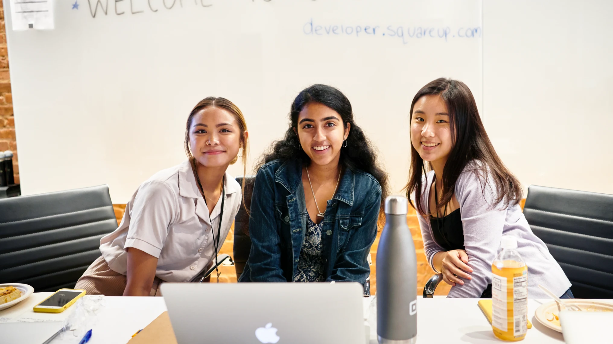

# Square Code Camp

In 2019, I had the amazing opportunity to be a part of the Square Code Camp hosted by Square for girls in North America. Square hosts a 5-day immersion program in order to inspire more women to learn about technology and make an impact on the industry. The program is great, consisting of many workshops, networking sessions, and seminars for students.

In 2019, I was in second year. I had just finished first year, and felt a little bit insecure. University was more of a challenge than I had expected, and I did not feel that I was performing well. I was almost at a point where I was doubting that Computer Science was the right path for me. 

However, through the Square Code Camp, I was able to redeem some of my best qualities that I had forgotten about: curiosity and perseverance. 

We were able to try out a handful of workshops, including iOS development and design brainstorming sessions. One of the most fun events were a mini hackathon they hosted amongst the participants. 